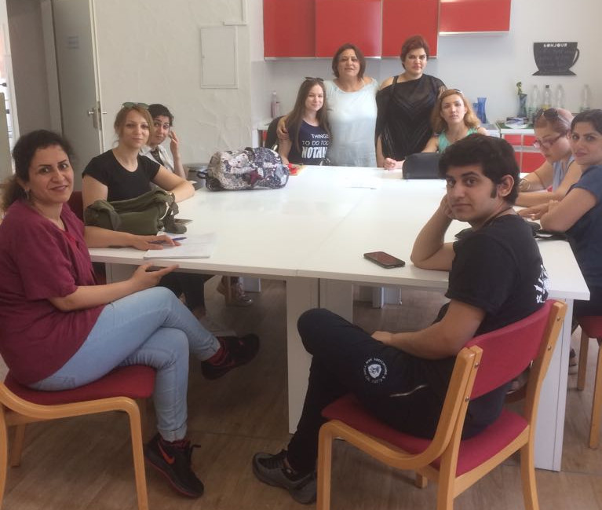

Einmal wöchentlich treffen sich Migrantinnen aus verschiedenen Ländern
in zwangloser Atmosphäre bei der Hürther Brücke der Kulturen. Sie
frühstücken gemeinsam, tauschen sich über ihre Lebenssituation aus und
erhalten Informationen über die für sie fremde Gesellschaftsstruktur
Deutschlands.

Anna Mussawi, die Projektleiterin, bereitet zu jedem Termin ein neues
Thema vor. Dieses wird im gemeinsamen Gespräch, anhand von Materialien
oder Erklärfilmen bearbeitet und diskutiert. Beispielsweise geht es um
Kinder und Frauenrechte, unser Gesundheitssystem und unser Schulsystem

 Die Familienstruktur in anderen Kulturen unterscheidet sich meist
 stark von der deutschen. Gerade Frauen mit Kindern ist der Zugang zur
 gesellschaftlichen Teilhabe erschwert. Viele haben in ihren Ländern
 keine Schule besucht. Besonders durch die fehlende Sprachkompetenz –
 meist gehen nur die Männer in die Deutschkurse – ist es für die
 Frauen sehr schwer, sich im öffentlichen Leben zu orientieren.

In der Gruppe erleben die Migrantinnen die Gemeinschaft und das Gefühl
der Isolation wird abgeschwächt. Da die Frauen unterschiedliche
Sprachen sprechen, ist es für sie unerlässlich, sich in der deutschen
Sprache zu verständigen. So werden Sprachkenntnisse erst vermittelt
und dann verbessert.

„Powerfrauen“ findet jeweils mittwochs von 10- 12 Uhr statt. Das
Angebot wird von der Stiftung „Herzenswunsch“ unterstützt.
