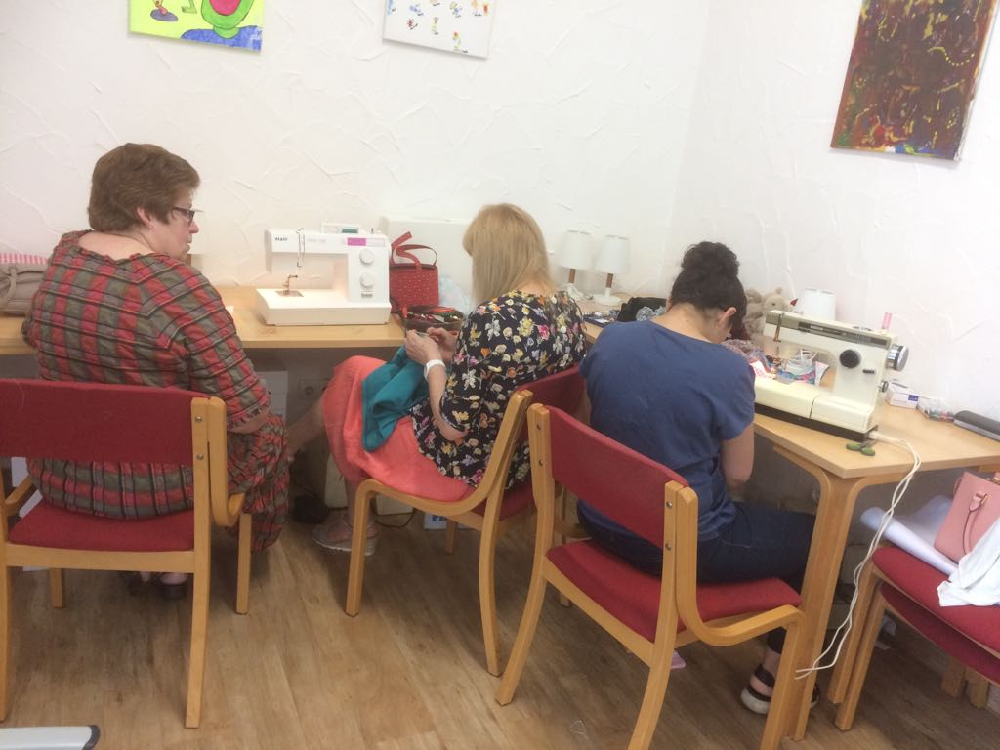
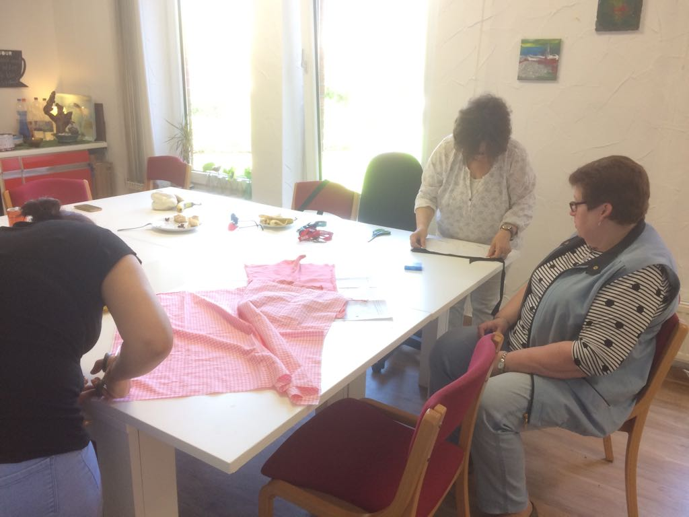
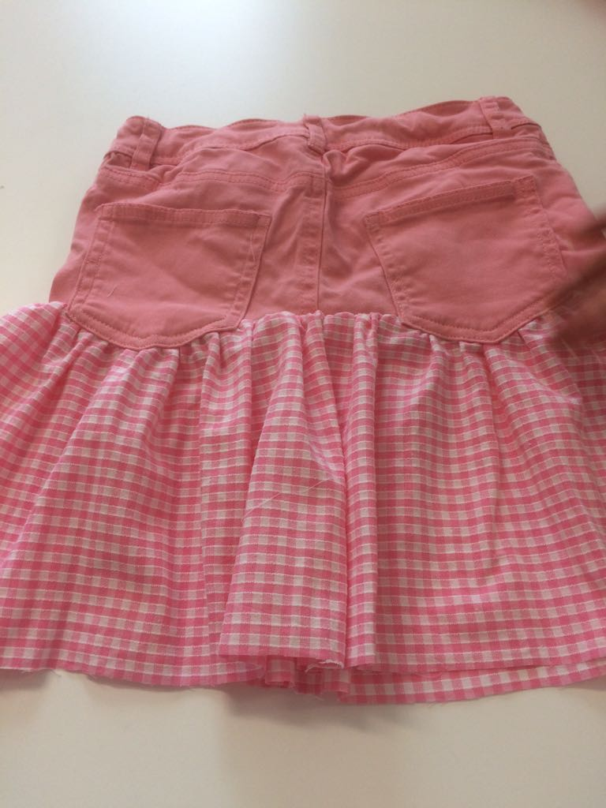
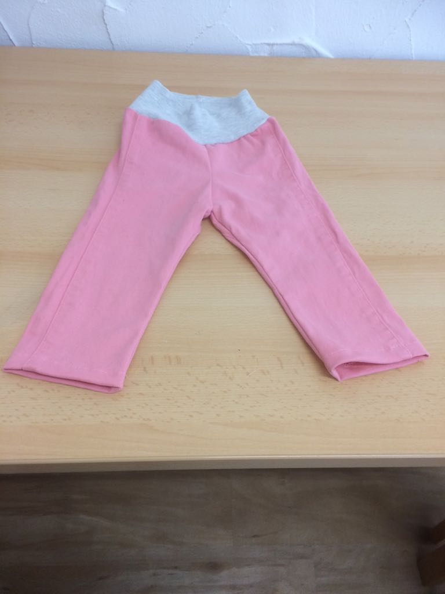

In dieser Gruppe können geflüchtete Frauen (besonders jene mit
Kleinkindern) kreativ sein. Aus ihrer Heimat sind die Frauen es
gewohnt, handwerklich zu arbeiten. Oftmals sind sie sehr
fortgeschritten in ihren Fertigkeiten und formulieren im Gespräch
diese Beschäftigung als Grundbedürfnis. In den Unterkünften haben sie
nicht die Möglichkeit, sich kreativ zu betätigen, denn es fehlen
Räumlichkeiten und Materialien.  Bei der Hürther Brücke als Ort der
Begegnung können sie gemeinsam mit Frauen aus unterschiedlichen
Ländern beispielsweise nähen oder eigene Kleidung ausbessern,
verändern oder neue schaffen. Gleiches gilt für Strickwaren. Ideen und
Vorschläge besprechen sie miteinander.

Das Hauptaugenmerk von Anna Mussawi, der Projektleiterin, liegt auf
der Entfaltung eigener Ideen und Nutzung der Fertigkeiten der
Frauen. Da die Frauen aus unterschiedlichen Ländern kommen, ist die
gemeinsame Sprache Deutsch. Nähmaschinen und anderes Material stehen
zur Verfügung. Stoff- und Wollspenden werden jederzeit gern
angenommen.

Für Kleinkinder, die noch nicht eine KITA besuchen, steht
altersgerechtes Spielzeug zur Verfügung. Die Betreuung der Kinder
obliegt der Gruppe. Die Kinder sind mit im Raum.  „Kreatives
Gestalten“ wird von der Hürther Bürgerstiftung unterstützt und findet
jeden Mittwoch von 12 bis 15:30 Uhr statt.

<section class="rollon_view">
	

		
		
		
		
	

</section>
